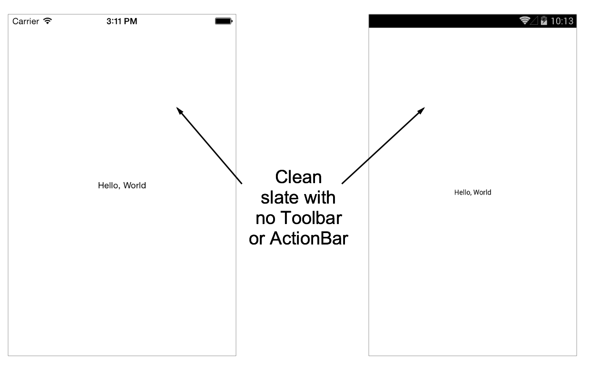

# Template.Platform-Agnostic-UI

Use this Alloy App Template if you'll be building your own navigation style, overriding the native UI containers.  This example offers a "clean slate" on both iOS and Android, on the latter hiding the ActionBar completely.

# License

This code is licensed under the Apache Public License (Version 2).